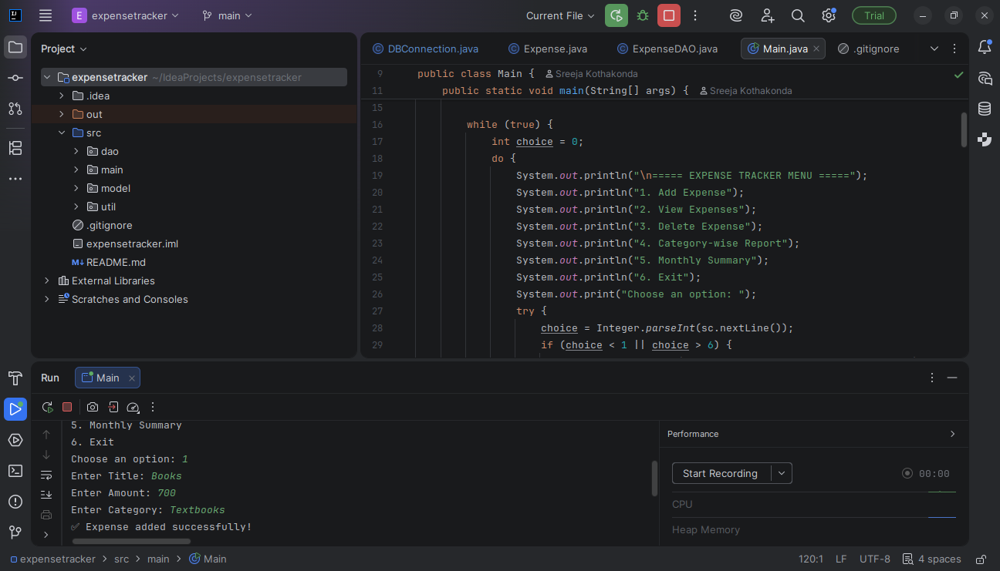
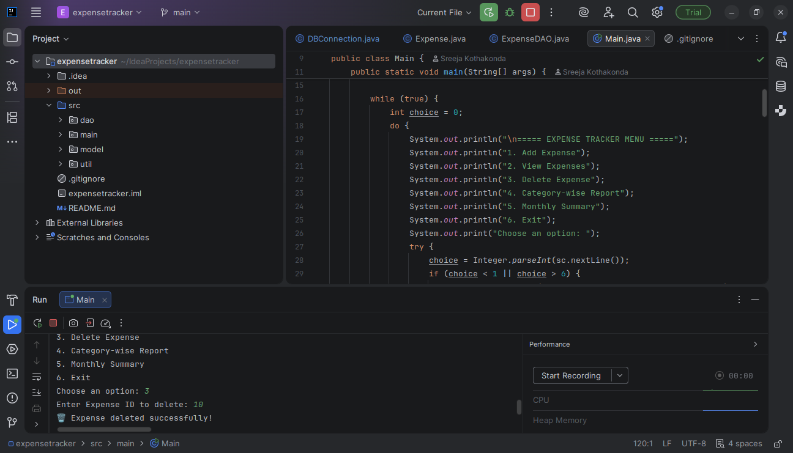
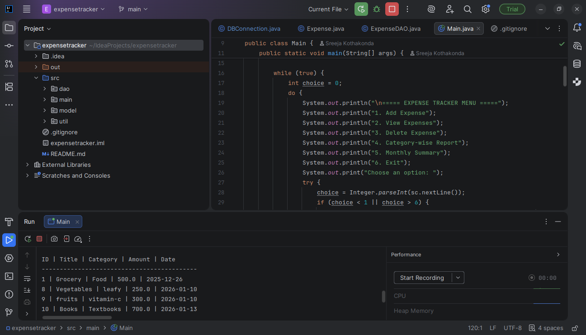
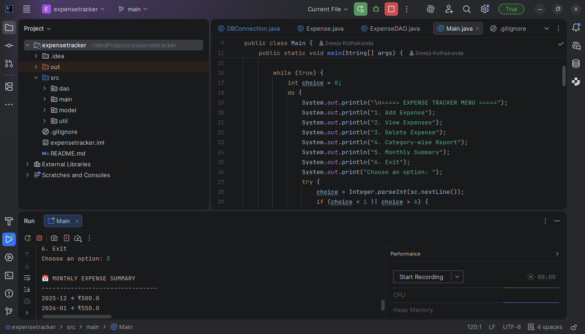

# 💰 Expense Tracker (Java + MySQL)

Short Project Description

👉 What the project is + why it exists

A console-based Expense Tracker application built using Java and MySQL.
It helps users record, manage, and analyze daily expenses efficiently.


## ✨ Features

- Add new expenses with input validation
- View all recorded expenses
- Delete expenses by ID
- Category-wise expense report
- Monthly expense summary
- Persistent storage using MySQL


## 🛠️ Technologies Used

- Java (JDK 17+)
- MySQL
- JDBC
- IntelliJ IDEA
- Git & GitHub


## 🗂️ Project Structure


ExpenseTracker/
├── src/
│ ├── dao/ → Database operations
│ ├── main/ → Main application logic
│ ├── model/ → Expense model
│ └── util/ → DB connection
├── screenshots/
├── README.md
└── .gitignore


## 🗄️ Database Schema

Table: expenses

| Column        | Type   |
|--------------|--------|
| id           | INT (PK, AUTO_INCREMENT) |
| title        | VARCHAR |
| category     | VARCHAR |
| amount       | DOUBLE |
| expense_date | DATE |


## ⚙️ How to Run the Project

1. Clone the repository
   ```bash
   git clone https://github.com/sreeja377/ExpenseTracker.git


Create MySQL database and table

Update database credentials in DBConnection.java

Run Main.java using IntelliJ IDEA


---


## 📸 Project Screenshots

### ➕ Add Expense


### ➖️Delete Expense


### 📄 View Expenses


### 📊 Category-wise Report


### 📅 Monthly Summary



## 🚀 Future Enhancements

- GUI using JavaFX
- User authentication
- Export reports to Excel/PDF
- Cloud database integration


## 👩‍💻 Author

Sreeja Kothakonda  
GitHub: https://github.com/sreeja377

